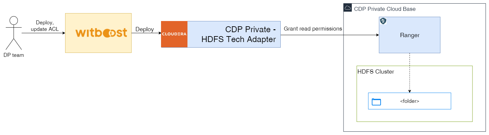

Use this template to create an Output Port that exposes and manages access to an HDFS directory

### Prerequisites

- A Data Product should already exist in order to attach the new components to it.
- An HDFS Storage component with useCaseTemplateId equal to `urn:dmb:utm:cdp-private-hdfs-storage-template:0.0.0` must exist on the chosen Data Product

### Component Metadata

This section includes the basic information that any Component of Witboost must have:

- Name: Required name used for display purposes on your Data Product
- Fully Qualified Name: Output Port fully qualified name, this is optional as will be generated by the system if not given by you
- Description: A short description to help others understand what this Output Port is for.
- Domain: The Domain of the Data Product this Output Port belongs to. Be sure to choose it correctly as is a fundamental part of the Output Port and cannot be changed afterwards.
- Data Product: The Data Product this Output Port belongs to, be sure to choose the right one.
- Identifier: Unique ID for this new entity inside the domain. Don't worry to fill this field, it will be automatically filled for you.
- Development Group: Development group of this Data Product. Don't worry to fill this field, it will be automatically filled for you.

*Example:*

| Field name              | Example value                                                                                      |
|:------------------------|:---------------------------------------------------------------------------------------------------|
| **Name**                | HDFS Vaccinations Output Port                                                                      |
| **Description**         | Exposes vaccinations data stored in an HDFS folder                                                 |
| **Domain**              | domain:healthcare                                                                                  |
| **Data Product**        | system:healthcare.vaccinationsdp.0                                                                 |
| ***Identifier***        | Will look something like this: *healthcare.vaccinationsdp.0.hdfs-vaccinations-output-port*         |
| ***Development Group*** | Might look something like this: *group:platformteam* Depends on the Data Product development group |

> Note: You might note that there is no *Depends On* field. The reason is that this component will depend on one and only one component of type HDFS Storage, which you'll choose on the next step

### Provide HDFS deployment information

This section includes the necessary information to choose the folder to expose inside HDFS. It allows the user to choose an existing HDFS Storage from the Data Product

*Example:*

| Field name                       | Example value                  |
|:---------------------------------|:-------------------------------|
| **HDFS Storage Area dependency** | HDFS Vaccinations Storage Area |

After clicking on **"Create"**, the Component registration will start. If no errors occur, it will go through the 3 phases (Fetching, Publishing and Registering) and it will show you the links to the newly created repository inside GitLab and the new Data Product Component in the Builder Catalog.
